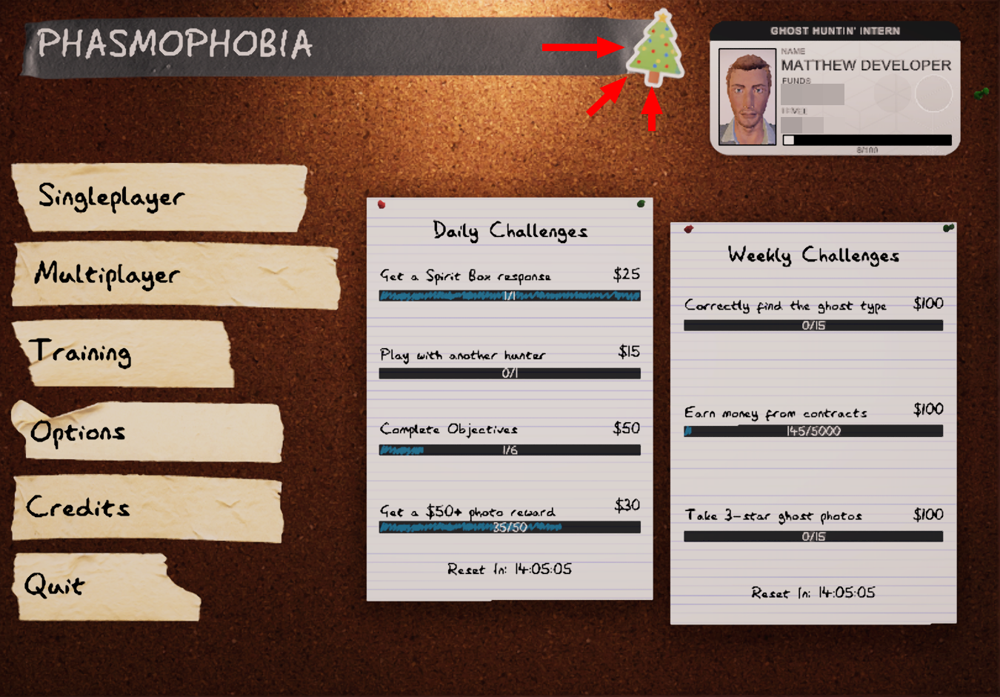
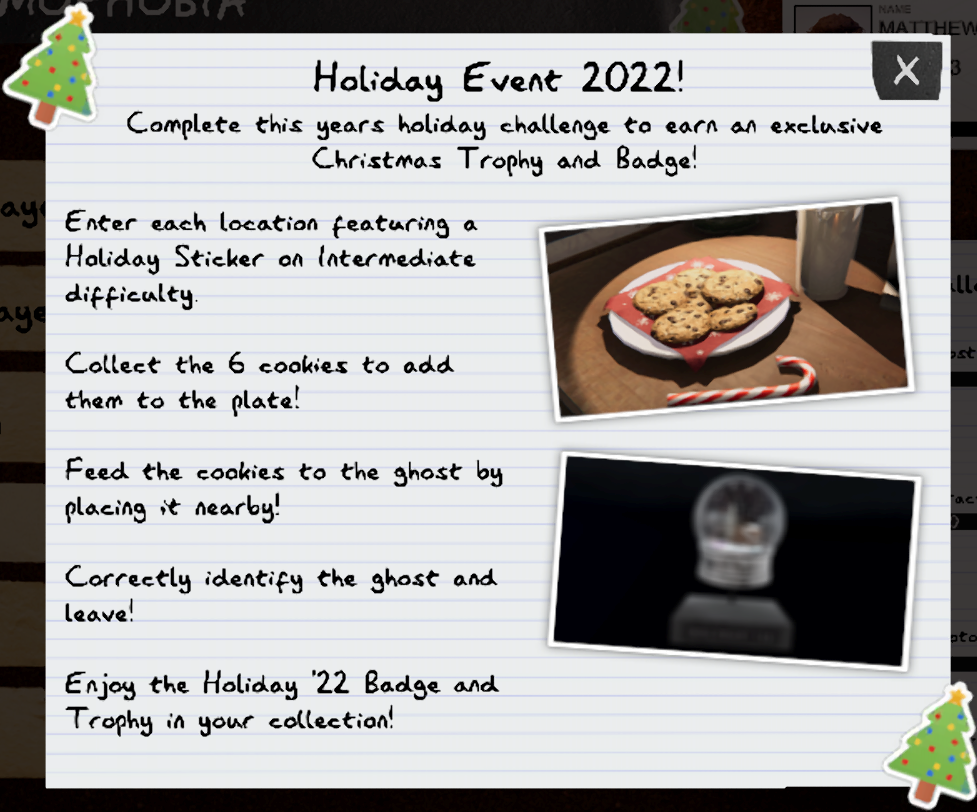
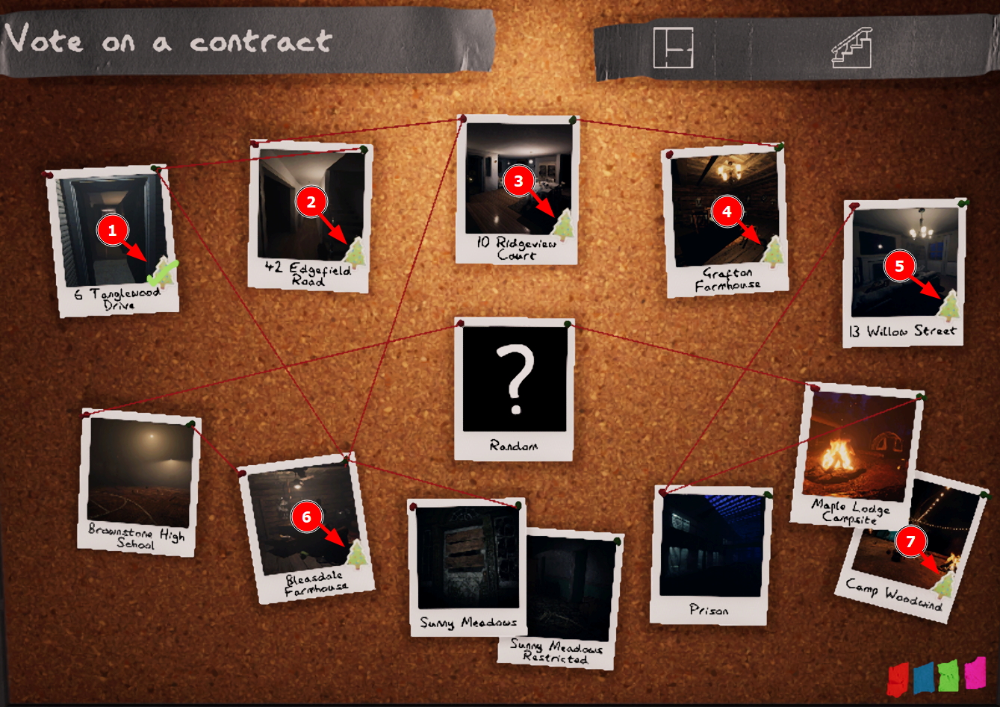

# Phasmophobia-HolidayEvent2022
Finding the cookies location is hard... this repository is a solution for that !

----

## Quick Links

- [Phasmophobia-HolidayEvent2022](#phasmophobia-holidayevent2022)
	- [Quick Links](#quick-links)
	- [Where's the cookie location ?](#wheres-the-cookie-location-)
	- [About the Holiday Event 2022](#about-the-holiday-event-2022)
	- [The event requirement](#the-event-requirement)
	- [After finding the cookie](#after-finding-the-cookie)
	- [The Cookie Location](#the-cookie-location)
	- [Contributing](#contributing)
	- [License](#license)

----

## Where's the cookie location ?

The guide for each cookie location on each game location can be found in the [locations](locations) folder. 

----

## About the Holiday Event 2022

In a major update (v0.8.0.0), the Phasmophobia Holiday Event 2022 and the update log is announced on the game's [steam announcement](https://store.steampowered.com/news/app/739630/view/3651886751537076286).

From the announcement, this event started after the update is live, and lasts until Early January 2023.

To people who have done the event, they will receive a Unique Holiday Trophy, and the exclusive Holiday '22 card and bagde.

The steps to get the trophy can be found by clicking the "Holiday Sticker" on the whiteboard at the lobby.

Which will reveal the steps to get the trophy, as follows:

----

## The event requirement

The player must :
1. Play the game on Intermediate difficulty
2. Correctly identify the ghost and selecting it on the Journal
3. Find and collect all cookie (6 total in each location)

The 2nd and 3rd requirement may be completed together at the same time, since when identifying the ghost the player may have found the cookies.

----
## After finding the cookie

1. Go back to the van, and grab the cookie plate
2. Place it so that the Ghost can ate the cookies
    
   I recommend placing the plate on the Ghost Room.
   
3. When the ghost ate the cookie, a Instant Hunt will be started, and the player must survive the hunt.
4. The player must make sure that they have selected the type of ghost at the journal
5. Close the van door, which will complete the mission.
6. Back on the main lobby, the Holiday Sticker for that location should have a green check/tick mark.

 
The player must complete the objective on all 7 location that has the holiday sticker icon while on Intermediate difficulty:

----

## The Cookie Location

The cookie location is hidden, as far as I know, the location are exactly the same for all player and all game session.

This is why I made this repository, to provide help for finding the cookie location.

----
## Contributing

If you have found the cookie location, please help by contributing to this repository.

You can contribute by :
1. Forking this repository
2. Follow the contributing recommendations in [CONTRIBUTING.md](CONTRIBUTING.md)

----

## License

This repository is licensed under the [MIT License](LICENSE), which means you can use this repository for any purpose, including commercial use, as long as you
include the license, the original author's name, and all of the contributors names in any redistribution you may make of the original or derived work.